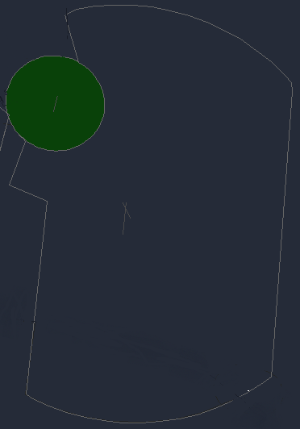

# Tower
The responsibility of Tower at King Shaka falls to the dedicated Tower ATS unit, "Cape Town Tower" (FACT_TWR) on 118.100. TWR will be responsible for the movements on the runway, as well as the responsibility of ensuring safety amongst VFR aircraft operating in the circuit or within the Cape Town CTR from GND - 2500ft MSL.

!!! Warning
        The green area indicates the AFB Ysterplaat ATZ, responsible from GND to 1500 ft, and not within Cape Town Tower’s area of responsibility.

!!! note
    As the frequency for departure is already handed in the IFR clearance, handoffs to the next ATS unit (Cape Town Approach) is not required with departing aircraft.

## Visual Flight Rules (VFR) Aircraft
* Caution when circuit traffic is to the East, advise Approach of the circuit traffic as any inbound aircraft doing a visual approach will require a clearance limit to remain clear of your circuit traffic.

### Circuit Altitudes
Recommended altitude limits for aircraft in the circuit:

| Aircraft Type | Altitude |
|:--------------:|:---------:|
| Jet | 2000 ft |
| Turbine / Piston | 1500 ft |
| Helicopter | 1000 ft |

!!! info "Circuit Clearance"
    ZSABC, hold position, after departure Runway 19, left hand circuits, not above 1500ft, report left downwind Runway 19.

### VFR Departures & Arrivals
Cape Town has published standard VFR departure, arrival, and transit routes via:

- **Kenilworth** to the **West**  
- **Bottleray Hills** to the **East**  
- **Coastwise Transit** to the **South**

For all VFR departures and arrivals, aircraft are to **climb to and maintain 1500 ft ALT**.

### VFR Departures

| Runway | Direction | Departure | CTR Exit Point | Report |
|:------:|:----------:|:-----------:|:----------------:|:--------:|
| 01 | East | Bottleray 01 Departure | North of Bottleray Road (M23) | Exiting CTR |
| 01 | West | Kenilworth 01 Departure | North of Guguletu Vlei | Exiting CTR |
| 19 | East | Bottleray 19 Departure | South of Bottleray Road (M23) | Exiting CTR |
| 19 | West | Kenilworth 19 Departure | South of Guguletu Vlei | Exiting CTR |

!!! info "Departure Clearence"
    ZSABC, cleared to East london, comply with the standard Bottleray 19 Departure, squawk 7044.

### VFR Arrivals

| Runway | Direction | Arrival | CTR Entry Point | Report |
|:------:|:----------:|:----------:|:----------------:|:--------:|
| 01 | East | Bottleray 01 Arrival | South of Bottleray Road (M23) | Right Downwind |
| 01 | West | Kenilworth 01 Arrival | South of Guguletu Vlei | Left Downwind |
| 19 | East | Bottleray 19 Arrival | North of Bottleray Road (M23) | Left Downwind |
| 19 | West | Kenilworth 19 Arrival | North of Guguletu Vlei | Right Downwind |

!!! info "Arrival Clearence"
    ZSABC, Information A, cleared inbound on the standard Kenilworth 19 Arrival, squawk 7044.

## Wake Seperation

### Arrivals (nm)
| Lead  | J | H | M | L |
| :---------: | :---------: | :---------: | :---------: | :---------: | 
| J     | ||||
| H     | 6 | 4 | ||
| M     | 7 | 5 | 5 | |
| L     | 8 | 6 | 5 | 5 |

### Departures (mins)

| Lead  | J | H | M | L |
| :---------: | :---------: | :---------: | :---------: | :---------: | 
| J     | ||||
| H     | 2 | |||
| M     | 3 | 2 | ||
| L     | 3 | 2 | 2 | |

!!! note   
    Aircraft which are not affected by wake turbulence, and are operating on a different SID to the leading aircraft infront may be released as soon as the first aircraft is airborne.

## Takeoff Phraseology

!!! info "Takeoff (Full Length)"
    ZSABC, Runway 19 full length, wind 180 degrees at 9 knots, cleared for takeoff, bye bye.

!!! info "Takeoff (Intersection)"
    ZSABC, Runway 19 at Intersection E1, wind 180 degrees at 9 knots, cleared for takeoff, bye bye.

## HIRO
If deemed necessary, HIRO will be in effect for landings into Runway 19/01. The aim is to expedite the flow of traffic to maximise efficiency and ensure the best arrival flow possible.

An aircraft may be cleared to land provided that:

* The Tower Controller is satisfied that the aircraft is turning and planning to vacate at a high speed exit provided.
* The aircraft is expected to keep moving past the stopbar and not come to a full stop.

!!! info "Landing with Traffic Vacating"
    EDW85, traffic vacating ahead via C, Runway 19, cleared to land.

## Missed Approach
All aircraft are to comply with the standard missed approaches to avoid conflict, the controllers are not to issue Runway Track until advised.

!!! info "Missed Approach"
    EDW85, comply standard missed approach.

Only once the pilot has been observed to be following the missed approach, should you then handoff to Cape Town Approach for further.

