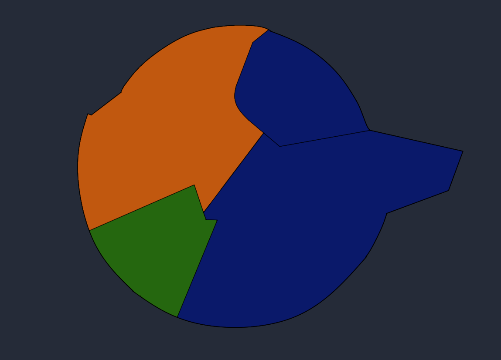
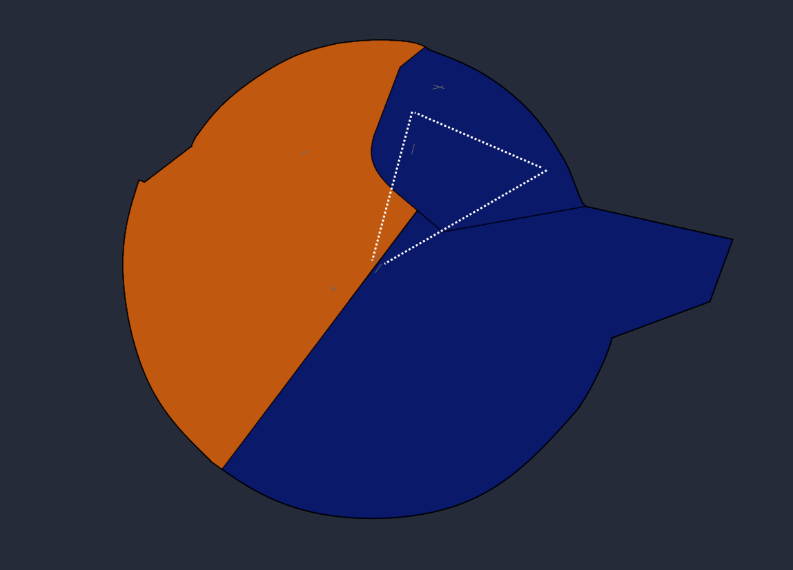

# Overview

FAOR_APP will be the main station responsible.
Controllers are not to log on FAOR_W_APP without Southeast Radar already being present.

FAOR_F_APP is only to log on with the presence of:
- Johannesburg Radar (**FAOR_APP**)
- O.R. Tambo Tower (**FAOR_TWR**) 

Both stations must be online for a Director to be permitted to log on in any scenario.

## Runway 03s

During Runway 03s at Johannesburg, the lateral splits of the TMA are defined below.

The area highlighted in blue represents the AOR of Johannesburg Southeast Radar (**FAOR_APP**) of this area.

The area highlighted in orange represents the AOR of Johannesburg West Radar (**FAOR_W_APP**). When offline, FAOR_APP will assume the duties.

The area represented in green represents the AOR of Johannesburg Director (**FAOR_F_APP**). When offline, FAOR_APP will assume all duties.

### Airports
In this configuration, the overlying controller for each airport will be:

FAOR | **FAOR_APP**
FAGM | **FAOR_W_APP**
FAGC | **FAOR_W_APP**
FALA | **FAOR_W_APP**
FAWK / FASK | **FAOR_APP**
FAWB | **FAOR_APP**

### Entry Points

AVAGO | **FAOR_W_APP**
EGPOP | **FAOR_W_APP**
NIBEX | **FAOR_F_APP**
OKPIT | **FAOR_APP**
UNPOM | **FAOR_APP**
UTRUK | **FAOR_W_APP**
WIV | **FAOR_APP**

### Exit Points

APDAK | **FAOR_APP**
EGMEN | **FAOR_APP**
GAV | **FAOR_W_APP**
GEROX | **FAOR_APP**
HGV | **FAOR_APP**
OVALA | **FAOR_APP**
NESAN | **FAOR_W_APP**
RAGUL | **FAOR_W_APP**
VASUR | **FAOR_W_APP**
XAGEN | **FAOR_W_APP**

## Runway 21s

During Runway 21s at Johannesburg, the lateral splits of the TMA are defined below.

The area highlighted in blue represents the AOR of Johannesburg Southeast Radar (**FAOR_APP**) of this area.

The area highlighted in orange represents the AOR of Johannesburg West Radar (**FAOR_W_APP**). When offline, FAOR_APP will assume the duties.

The area represented by the dashed lines represents the AOR of Johannesburg Director (**FAOR_F_APP**). When offline, FAOR_APP will assume all duties.

### Airports
In this configuration, the overlying controller for each airport will be:

FAOR | **FAOR_APP**
FAGM | **FAOR_W_APP**
FAGC | **FAOR_W_APP**
FALA | **FAOR_W_APP**
FAWK / FASK | **FAOR_APP**
FAWB | **FAOR_APP**

### Entry Points

AVAGO | **FAOR_W_APP**
EGPOP | **FAOR_W_APP**
NIBEX | **FAOR_W_APP**
OKPIT | **FAOR_APP**
UNPOM | **FAOR_APP**
UTRUK | **FAOR_W_APP**
WIV | **FAOR_APP**

### Exit Points

APDAK | **FAOR_APP**
EGMEN | **FAOR_APP**
GAV | **FAOR_W_APP**
GEROX | **FAOR_APP**
HGV | **FAOR_APP**
OVALA | **FAOR_APP**
NESAN | **FAOR_W_APP**
RAGUL | **FAOR_W_APP**
VASUR | **FAOR_W_APP**
XAGEN | **FAOR_W_APP**
